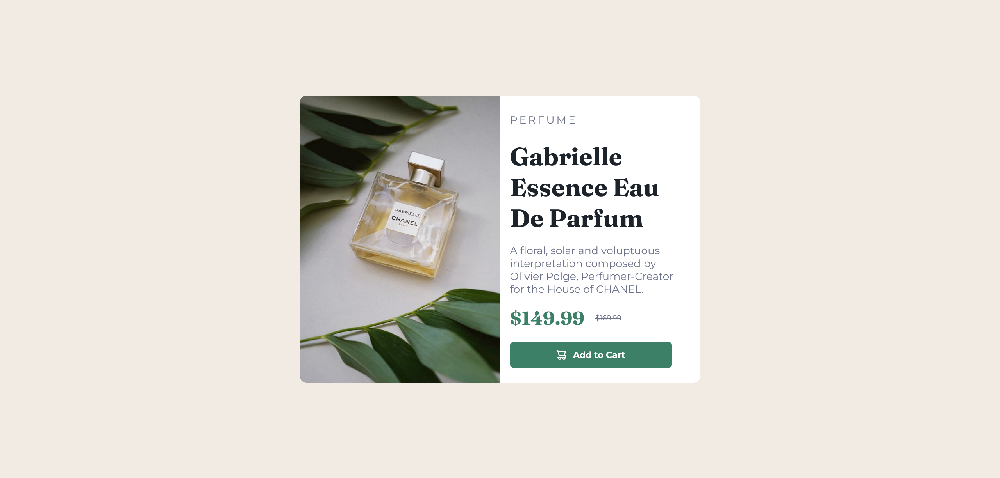

# Frontend Mentor - Product preview card component solution

This is a solution to the [Product preview card component challenge on Frontend Mentor](https://www.frontendmentor.io/challenges/product-preview-card-component-GO7UmttRfa). Frontend Mentor challenges help you improve your coding skills by building realistic projects. 

## Table of contents

- [Overview](#overview)
  - [The challenge](#the-challenge)
  - [Screenshot](#screenshot)
  - [Links](#links)
- [My process](#my-process)
  - [Built with](#built-with)
  - [What I learned](#what-i-learned)
  - [Continued development](#continued-development)
  - [Useful resources](#useful-resources)
- [Author](#author)
- [Acknowledgments](#acknowledgments)

## Overview

### The challenge

Users should be able to:

- View the optimal layout depending on their device's screen size
- See hover and focus states for interactive elements

### Screenshot


 - Screenshot of the project

### Links

- Live Site URL: [Live Server URL]()

## My process

### Built with

- Semantic HTML5 markup
- CSS custom properties
- Flexbox
- CSS Grid
- Mobile-first workflow

### What I learned

I have learned how to make simple templates using HTML and CSS with help of flex properties and grid properties .

Observe below code for given project.

```html
<!DOCTYPE html>
<html lang="en">

<head>
    <meta charset="UTF-8">
    <meta name="viewport" content="width=device-width, initial-scale=1.0">
    <link rel="icon" type="image/png" sizes="32x32" href="./images/favicon-32x32.png">
    <link rel="stylesheet" href="style.css">
    <title>Frontend Mentor | Product preview card component</title>
</head>

<body>

    <div id="wrapper">
        <div class="card">
            <div class="left">
                
            </div>
            <div class="right">
                <div class="content">
                    <div class="top lgray">
                        <p>Perfume</p>
                    </div>
                    <div class="head">
                        <h2>
                            Gabrielle Essence Eau De Parfum
                        </h2>
                    </div>
                    <div class="para lgray">
                        <p>
                            A floral, solar and voluptuous interpretation composed by Olivier Polge,
                            Perfumer-Creator for the House of CHANEL.
                        </p>
                    </div>
                    <div class="tag">
                        <p>
                            $149.99
                        </p>
                        <span class="lgray">
                            $169.99
                        </span>
                    </div>
                    <div class="button">
                        <button>
                            
                            Add to Cart
                        </button>
                    </div>
                </div>
            </div>
        </div>
    </div>

    <div class="attribution">
        Challenge by <a href="https://www.frontendmentor.io?ref=challenge" target="_blank">Frontend Mentor</a>.
        Coded by <a href="#">Prasanna Pandhare</a>.
    </div>
</body>

</html>
```
```css
@import url('https://fonts.googleapis.com/css2?family=Montserrat:wght@400;700&display=swap');
@import url('https://fonts.googleapis.com/css2?family=Fraunces:opsz,wght@9..144,700&family=Montserrat:wght@400;700&display=swap');


* {
    margin: 0;
    padding: 0;
    box-sizing: border-box;
}

#wrapper {
    height: 100vh;
    width: 100%;
    overflow-x: hidden;
    background-color: hsl(30, 38%, 92%);
    display: flex;
    justify-content: center;
    align-items: center;
}

.card {
    height: 60%;
    width: 40%;
    border-radius: 10px;
    overflow: hidden;
    display: grid;
    grid-template-columns: 50% 50%;
    grid-template-rows: 100%;
}

.left {
    width: 100%;
    height: 100%;
}

.left img {
    height: 100%;
    width: 100%;
}

.right {
    width: 100%;
    height: 100%;
    display: flex;
    justify-content: center;
    align-items: center;
    background-color: white;
}

.content {
    height: 90%;
    width: 90%;
}

.top {
    margin-top: 2%;
    margin-bottom: 8%;
    text-transform: uppercase;
    letter-spacing: 3px;
    font-family: "Montserrat", sans-serif;
    font-weight: 400;
}

.head {
    color: hsl(212, 21%, 14%);
    font-size: 160%;
    font-family: "Fraunces", sans-serif;
    margin-bottom: 6%;
}

.para p {
    font-family: "Montserrat", sans-serif;
    font-weight: 400;
    margin-bottom: 6%;
}

.tag {
    display: flex;
    align-items: center;
    gap: 6%;
    margin-bottom: 7%;
}

.tag p {
    font-family: "Fraunces", sans-serif;
    color: hsl(158, 36%, 37%);
    font-size: 180%;
}

span {
    font-family: "Montserrat", sans-serif;
    text-decoration: line-through;
    font-weight: 400;
    font-size: 70%;
}

.button {
    display: flex;
    align-items: center;
}

button {
    color: white;
    background-color: hsl(158, 36%, 37%);
    border: none;
    height: 40px;
    width: 90%;
    border-radius: 5px;
    display: flex;
    align-items: center;
    justify-content: center;
    gap: 4%;
    font-family: "Montserrat", sans-serif;
    font-weight: 700;
    cursor: pointer;
}

button:hover {
    filter: brightness(60%);
}

.lgray {
    color: hsl(228, 12%, 48%);
}

.attribution {
    font-size: 11px;
    text-align: center;
}

.attribution a {
    color: hsl(228, 45%, 44%);
    text-decoration: none;
}

@media screen and (width<=526px) {
    #wrapper {
        display: flex;
        flex-direction: column;
        justify-content: center;
        align-items: center;
        min-width: 375px;
        height: 100%;
        padding-left: 15px;
        padding-right: 15px;
        padding-top: 50px;
        padding-bottom: 50px;
        background-image: url(images/bg-mobile.svg);
        background-repeat: no-repeat;
        background-size: 100%;
    }

    .card {
        width: 90%;
        height: 90%;
        display: grid;
        grid-template-columns: 100%;
        grid-template-rows: 50% 50%;
    }

    button {
        height: 40px;
    }

    .attribution {
        text-align: center;
        font-size: 9px;
    }
}

@media screen and (width<=375px) {

    #wrapper {
        display: flex;
        flex-direction: column;
        justify-content: center;
        align-items: center;
        height: 100%;
        padding-left: 15px;
        padding-right: 15px;
        padding-top: 50px;
        padding-bottom: 50px;
        background-image: url(images/image-product-mobile.jpg);
        background-repeat: no-repeat;
        background-size: 100%;
    }

    .card {
        width: 90%;
        height: 90%;
        display: grid;
        grid-template-columns: 100%;
        grid-template-rows: 50% 50%;
    }

    button {
        height: 40px;
    }

    .attribution {
        text-align: center;
        font-size: 4px;
    }

}
```

### Continued development

I am trying to improve my skills in media queries.

### Useful resources

- [MDN Docs](https://developer.mozilla.org/en-US/) - Helped me in various learnings. 

## Author

- Website - [Prasanna Pandhare](https://www.your-site.com)
- Frontend Mentor - [@Prasannapandhare](https://www.frontendmentor.io/profile/Prasannapandhare)

## Acknowledgments

I understood the importance of CSS in designing HTML structure.
As well as understood about responsive websites.